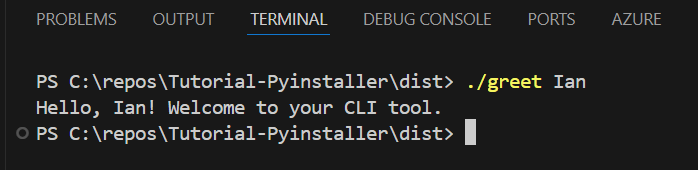

A small repo dedicated to desigining a CLI tool with Python via the pyinstaller module.
For details about pyinstaller, see [pyinstaller docs](https://pyinstaller.org/en/stable/).

# Instuctions

1. `pip install -r requirements.txt` or `pip install pyinstaller`
2. May need to uninstall pathlib module: `pip uninstall pathlib`
3. `pyinstaller --onefile mycli.py`, to rename the .exe: `pyinstaller --onefile --name greet mycli.py`
4. `cd dist` Check the `/dist` folder
5. (optional) add the .exe to your path variable
6. (optional) access help menu: `./greet.exe --help`
7. To execute: `./greet Ian`

    Results:

        